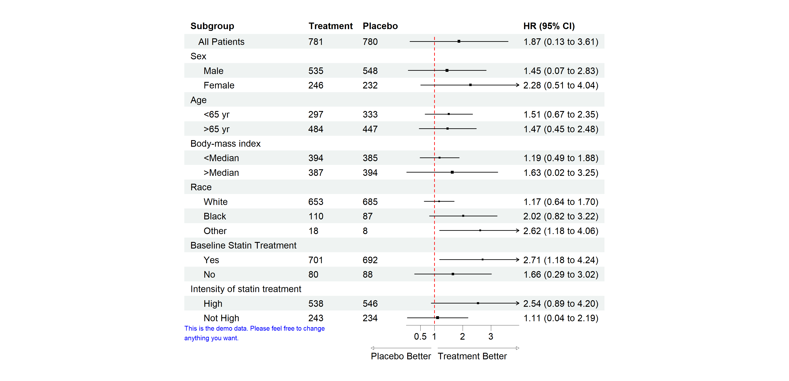
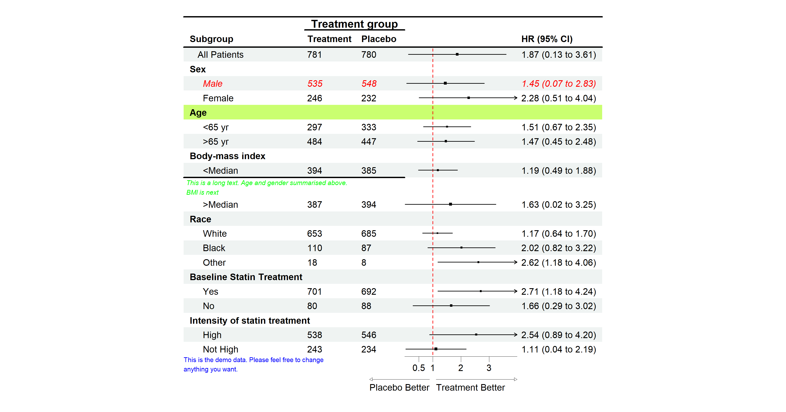
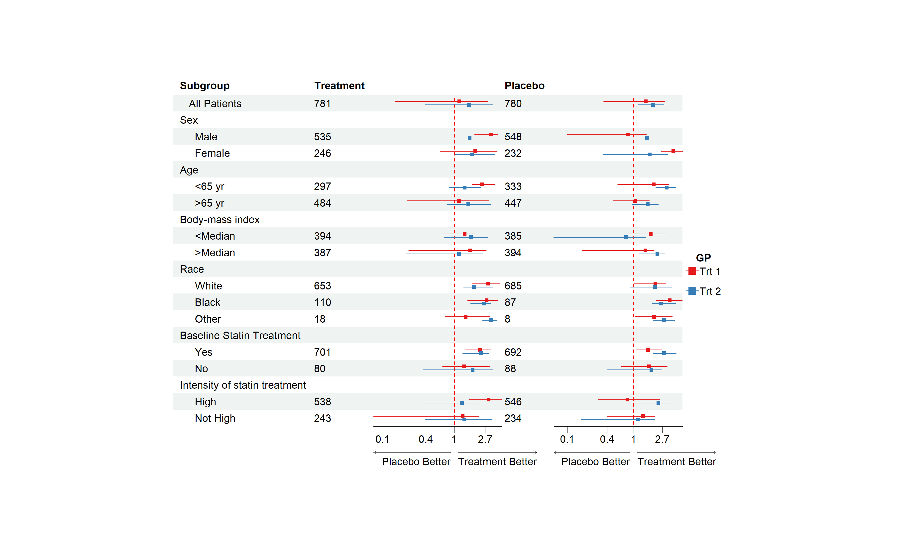

<!-- README.md is generated from README.Rmd. Please edit that file -->

# forestploter

<!-- badges: start -->

[](https://github.com/adayim/forestploter/actions)
[](https://CRAN.R-project.org/package=forestploter)
[](https://cran.r-project.org/package=forestploter)
[](https://app.codecov.io/gh/adayim/forestploter?branch=main)
<!-- badges: end -->

The goal of `forestploter` is to create publication-ready forest plots
with minimal effort. This package offers more flexibility and
customization options compared to other packages. The layout of the
forest plot is determined by the provided dataset, and its elements are
organized in a grid-like structure of rows and columns, much like a
table. This design allows for easy manipulation of any plot component.
For instance, the width of the confidence interval column can be
controlled by adjusting the number of spaces in a blank character
column.

## Installation

You can install the development version of `forestploter` from
[GitHub](https://github.com/adayim/forestploter) with:

**Install from CRAN**

``` r
install.packages("forestploter")
```

**Install development version from GitHub**

``` r
# install.packages("devtools")
devtools::install_github("adayim/forestploter")
```

## Basic Usage

The column names of the provided data will be used as the header of the
plot. This is a basic example that demonstrates how to create a
`forestplot`:

``` r
library(grid)
library(forestploter)

dt <- read.csv(system.file("extdata", "example_data.csv", package = "forestploter"))

# Indent the subgroup if there is a number in the placebo column
dt$Subgroup <- ifelse(is.na(dt$Placebo), 
                      dt$Subgroup,
                      paste0("   ", dt$Subgroup))

# NA to blank
dt$Treatment <- ifelse(is.na(dt$Treatment), "", dt$Treatment)
dt$Placebo <- ifelse(is.na(dt$Placebo), "", dt$Placebo)
dt$se <- (log(dt$hi) - log(dt$est))/1.96

# Add a blank column for the forest plot to display CI.
# Adjust the column width with space. 
dt$` ` <- paste(rep(" ", 20), collapse = " ")

# Create confidence interval column to display
dt$`HR (95% CI)` <- ifelse(is.na(dt$se), "",
                             sprintf("%.2f (%.2f to %.2f)",
                                     dt$est, dt$low, dt$hi))

# Define theme
tm <- forest_theme(base_size = 10,
                   refline_col = "red",
                   arrow_type = "closed",
                   footnote_gp = gpar(col = "blue", cex = 0.6))
#> refline_col will be deprecated, use refline_gp instead.

p <- forest(dt[,c(1:3, 20:21)],
            est = dt$est,
            lower = dt$low, 
            upper = dt$hi,
            sizes = dt$se,
            ci_column = 4,
            ref_line = 1,
            arrow_lab = c("Placebo Better", "Treatment Better"),
            xlim = c(0, 4),
            ticks_at = c(0.5, 1, 2, 3),
            footnote = "This is the demo data. Please feel free to change\nanything you want.",
            theme = tm)

# Print plot
plot(p)
```



## Editing the Plot

You may want to change the color or font of certain columns, insert text
into specific rows, or add an underline to separate groups. The
`edit_plot`, `add_text`, `insert_text`, and `add_border` functions are
designed for these purposes. Here is how you can use them:

``` r
# Edit text in row 3
g <- edit_plot(p, row = 3, gp = gpar(col = "red", fontface = "italic"))

# Bold grouping text
g <- edit_plot(g,
               row = c(2, 5, 8, 11, 15, 18),
               gp = gpar(fontface = "bold"))

# Insert text at the top
g <- insert_text(g,
                 text = "Treatment group",
                 col = 2:3,
                 part = "header",
                 gp = gpar(fontface = "bold"))

# Add underline at the bottom of the header
g <- add_border(g, part = "header", row = 1, where = "top")
g <- add_border(g, part = "header", row = 2, where = "bottom")
g <- add_border(g, part = "header", row = 1, col = 2:3, 
                gp = gpar(lwd = 2))

# Edit the background of row 5
g <- edit_plot(g, row = 5, which = "background",
               gp = gpar(fill = "darkolivegreen1"))

# Insert text
g <- insert_text(g,
                 text = "This is a long text. Age and gender summarised above.\nBMI is next",
                 row = 10,
                 just = "left",
                 gp = gpar(cex = 0.6, col = "green", fontface = "italic"))
g <- add_border(g, row = 10, col = 1:3, where = "top")
plot(g)
```



Remember to add 1 to the row number if you have inserted any text
before, as the row number will change after inserting text.

## Complex Usage

If you want to draw CIs in multiple columns, you only need to provide a
vector of the column positions in the data. As shown in the example
below, the CIs will be drawn in columns 3 and 5, with the first and
second `est`, `lower`, and `upper` values corresponding to those
columns.

For more complex scenarios, such as drawing CIs by groups, you can
provide an additional set of `est`, `lower`, and `upper` values. If the
number of `est`, `lower`, and `upper` sets is greater than the number of
CI columns, the values will be reused. In the example below, `est_gp1`
and `est_gp2` are drawn in columns 3 and 5 as **group 1**, while
`est_gp3` and `est_gp4` are drawn in the same columns as **group 2**.

This is an example of multiple CI columns and groups:

``` r

# Add a blank column for the second CI column
dt$`   ` <- paste(rep(" ", 20), collapse = " ")

# Set-up theme
tm <- forest_theme(base_size = 10,
                   refline_col = "red",
                   footnote_gp = gpar(col = "blue"),
                   legend_name = "GP",
                   legend_value = c("Trt 1", "Trt 2"))
#> refline_col will be deprecated, use refline_gp instead.

p <- forest(dt[,c(1:2, 20, 3, 22)],
            est = list(dt$est_gp1,
                       dt$est_gp2,
                       dt$est_gp3,
                       dt$est_gp4),
            lower = list(dt$low_gp1,
                         dt$low_gp2,
                         dt$low_gp3,
                         dt$low_gp4), 
            upper = list(dt$hi_gp1,
                         dt$hi_gp2,
                         dt$hi_gp3,
                         dt$hi_gp4),
            ci_column = c(3, 5),
            ref_line = 1,
            arrow_lab = c("Placebo Better", "Treatment Better"),
            nudge_y = 0.2,
            x_trans = "log",
            theme = tm)

plot(p)
```


