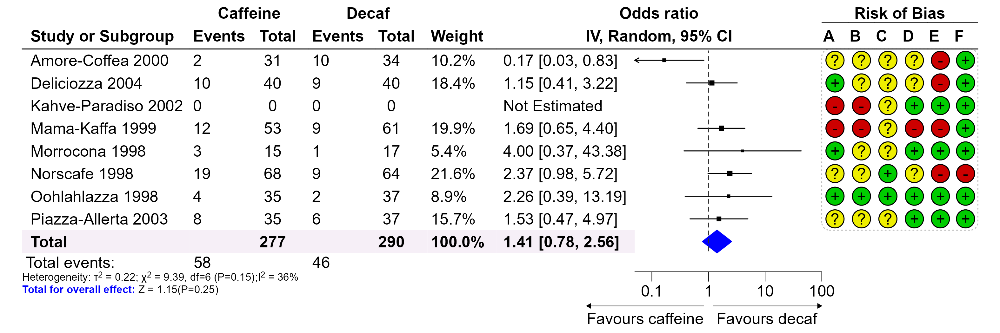

```{r, include = FALSE}
knitr::opts_chunk$set(
  collapse = TRUE,
  dpi = 300,
  comment = "#>"
)
```

# Post-editing a Forest Plot

The `forestploter` package creates plots where all elements are placed in cells. This structure makes it easy to edit any element by specifying its row and column. This vignette demonstrates how to post-edit a forest plot to achieve a publication-ready figure.

The plotting steps demonstrated in this vignette may not necessarily be optimal. There are other R packages that may be better suited for the plots demonstrated here. Please choose the one that best suits your needs. The final plot is shown below:

```{r final-plot, out.width = '95%', echo = FALSE}

```

# Drawing a Forest Plot

We will start by drawing a forest plot using an example from the [metafor](https://www.metafor-project.org/doku.php/plots:forest_plot_revman) package, which is similar to the plot shown above. First, we load the data and create a simple forest plot.

```{r meta-forest, out.width="95%", fig.width = 10.6, fig.height = 3.6}
library(grid)
library(forestploter)

# Read meta-analysis example data
dt <- read.csv(system.file("extdata", "metadata.csv", package = "forestploter"))

str(dt)

# Prepare a blank column for the CI
dt$cicol <- paste(rep(" ", 20), collapse = " ")

# Select some columns for plotting; this will serve as the skeleton of the forest plot
dt_fig <- dt[, c(1:7, 17, 8:13)]

colnames(dt_fig) <- c("Study or Subgroup",
                      "Events", "Total", "Events", "Total",
                      "Weight",
                      "", "",
                      LETTERS[1:6])

dt_fig$Weight <- sprintf("%0.1f%%", dt_fig$Weight)
dt_fig$Weight[dt_fig$Weight == "NA%"] <- ""

# Convert NA to a blank string
dt_fig[is.na(dt_fig)] <- ""

# Set background to white and summary diamond to black
tm <- forest_theme(core = list(bg_params = list(fill = c("white"))),
                   summary_col = "black",
                   arrow_label_just = "end",
                   arrow_type = "closed")

p <- forest(dt_fig,
            est = dt$est,
            lower = dt$lb, 
            upper = dt$ub,
            sizes = sqrt(dt$weights / 100),
            is_summary = c(rep(FALSE, nrow(dt) - 1), TRUE),
            ci_column = 8,
            ref_line = 1,
            x_trans = "log",
            arrow_lab = c("Favours caffeine", "Favours decaf"),
            xlim = c(0.05, 100),
            ticks_at = c(0.1, 1, 10, 100),
            theme = tm)
p
```

# Editing the Forest Plot

The `forestploter` package provides several functions to modify a forest plot. These functions allow you to edit various aspects of the plot:

-   `edit_plot`: Changes the graphical parameters of text, backgrounds, and CIs (e.g., the color or font face of specific cells).
-   `add_text`: Adds text to specific rows and columns. This is useful for complex text alignment, as you can leave some rows or columns blank and then add text to them.
-   `insert_text`: Inserts a row and adds text before or after a specified row. This is useful for inserting text between groups.
-   `add_border`: Adds a border to specific cells.
-   `add_grob`: Adds various graphical objects (grobs) to the plot.

## Editing the Plot

Below, we will make the "Total" row text bold, change the color of the diamond shape, and modify the background color of the "Total" row. We will also align the text in the last six columns to the center.

```{r edit-metaplot, out.width="95%", fig.width = 10.6, fig.height = 3.6}
# Change font face
g <- edit_plot(p, row = 9, 
               gp = gpar(fontface = "bold"))

# Change color
g <- edit_plot(g, col = 8, row = 9, which = "ci", 
               gp = gpar(col = "blue", fill = "blue"))

# Change the background of the total row
g <- edit_plot(g, col = 1:7, 
               row = 9, 
               which = "background", 
               gp = gpar(fill = "#f6eff7"))

# Align text to center
g <- edit_plot(g, col = 9:14, 
               which = "text",
               hjust = unit(0.5, "npc"),
               x = unit(0.5, "npc"))
g
```

For text alignment: - `hjust = unit(0, "npc")` and `x = unit(0, "npc")` align text to the left. - `hjust = unit(0.5, "npc")` and `x = unit(0.5, "npc")` center-align text. - `hjust = unit(1, "npc")` and `x = unit(0.9, "npc")` align text to the right.

## Adding and Inserting Text

In this step, we will add text to the header and display the total number of events from the data.

```{r text-metaplot, out.width="95%", fig.width = 10.6, fig.height = 3.6}
# Add or insert some text to the header on top of CI columns
g <- add_text(g, text = "IV, Random, 95% CI",
              part = "header", 
              col = 7:8,
              gp = gpar(fontface = "bold"))

g <- insert_text(g, text = "Odds ratio",
                 part = "header", 
                 col = 7:8,
                 gp = gpar(fontface = "bold"))

# Group outcomes
g <- add_text(g, text = "Caffeine",
              part = "header",
              row = 1,
              col = 2:3,
              gp = gpar(fontface = "bold"))

g <- add_text(g, text = "Decaf",
              part = "header", 
              row = 1,
              col = 4:5,
              gp = gpar(fontface = "bold"))

# Add text on the top of the risk of bias data
g <- add_text(g, text = "Risk of Bias",
              part = "header", 
              row = 1,
              col = 9:14,
              gp = gpar(fontface = "bold"))

# Insert event count
g <- insert_text(g, 
                 text = c("Total events:"),
                 row = 9,
                 col = 1,
                 before = FALSE,
                 just = "left")

# Note: The row counts need to add one to account for 
# `insert_text` in the previous step
g <- add_text(g, text = "58",
              col = 2,
              row = 10,
              just = "left")

g <- add_text(g, text = "46",
              col = 4,
              row = 10,
              just = "left")

g
```

## Adding Borders

In this step, we will add borders to the header. By default, `add_border` adds a border to the bottom of the specified cell(s).

```{r border-metaplot, out.width="95%", fig.width = 10.6, fig.height = 3.6}
# Add or insert some text to the header
g <- add_border(g, 
                part = "header", 
                row = 1,
                col = 9:14,
                gp = gpar(lwd = .5))

g <- add_border(g, 
                part = "header", 
                row = 2,
                gp = gpar(lwd = 1))

g
```

## Adding Grobs

In the next step, we will add a rounded rectangle with a dashed line around the risk of bias data. Then, we will draw circle grobs with different colors at the bottom of the text.

```{r grob-metaplot, out.width="95%", fig.width = 10.6, fig.height = 3.6}
g <- add_grob(g, 
              row = 1:c(nrow(dt_fig) - 1), 
              col = 9:14,
              order = "background",
              gb_fn = roundrectGrob,
              r = unit(0.05, "snpc"),
              gp = gpar(lty = "dotted",
                        col = "#bdbdbd"))

# Draw a circle grob; you can also draw a `pointsGrob`
cols <- c("#eeee00", "#00cc00", "#cc0000")
symb <- c("?", "+", "-")
for(i in seq_along(symb)){
  pos <- which(dt_fig == symb[i], arr.ind = TRUE)
  for(j in 1:nrow(pos)){
    g <- add_grob(g, 
                  row = pos[j, 1], 
                  col = pos[j, 2],
                  order = "background",
                  gb_fn = circleGrob,
                  r = 0.4,
                  gp = gpar(fill = cols[i]))
  }
}

g
```

The text we want to create involves math expressions and multiple lines. While this can be done with `add_text` by setting `parse = TRUE`, we can use the code below to achieve our desired result. The line break is based on a solution found [here](https://stackoverflow.com/questions/18237134/line-break-in-expression), which uses the `atop` function. You can also use the [latex2exp](https://CRAN.R-project.org/package=latex2exp) package for math expressions.

```{r txtgrob-metaplot, out.width="95%", fig.width = 10.6, fig.height = 3.6}
txt <- bquote(atop(paste("Heterogeneity: ", tau^2, " = 0.22; ",
                         chi^2, " = 9.39, df = 6 (P = 0.15) ",
                         I^2, " = 36%"),
            "Total for overall effect: Z = 1.15 (P = 0.25)"))

add_text(g, text = txt,
         col = 1:6,
         row = 11,
         just = "left",
         parse = TRUE,
         gp = gpar(fontsize = 8))
```

As you can see, the second line is not left-aligned. To address this, we can use `add_grob` to leverage other packages that create `grob` objects. In this case, we will use the [gridtext](https://CRAN.R-project.org/package=gridtext) package to generate complex text and add it to the plot. More details about this package can be found [here](https://wilkelab.org/gridtext/index.html). With `gridtext`, you can write and render Markdown or HTML text in your plot. However, it does not currently support math equations. For Unicode math symbols, you can refer to this resource [here](https://www.stat.auckland.ac.nz/~paul/R/CM/AdobeSym.html).

```{r gridtext-metaplot, out.width="95%", fig.width = 10.6, fig.height = 3.6}
txt <- "Heterogeneity: &tau;<sup>2</sup> = 0.22; &chi;<sup>2</sup> = 9.39,
df = 6 (P = 0.15); I<sup>2</sup> = 36%<br><span style='color:blue'>**Total for overall effect:**</span> Z = 1.15 (P = 0.25)"

add_grob(g, 
         row = 11, 
         col = 1:6,
         order = "background",
         gb_fn = gridtext::richtext_grob,
         text = txt,
         gp = gpar(fontsize = 8),
         hjust = 0, vjust = 1, halign = 0, valign = 1,
         x = unit(0, "npc"), y = unit(1, "npc"))
```

